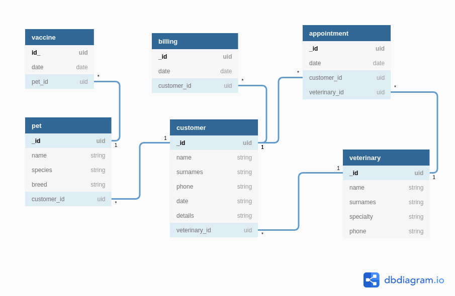

# Veterinaria Nest.JS API

## **Diagrama de base de datos**

## **Consideraciones**

- No se utilizó documentos embebidos por lo que hubo que crear tablas apartir de la normalización aunque muchas de las tablas no son solicitadas en el enunciado.

- Normalmente se genera la fecha desde el servidor para sincronizar la fecha y hora con la zona horaria del mismo pero en este caso pasamos las fechas como parametros del body de las peticiones

- Validación de tipos mediante la libreria Joi de Hapi esto para remplazar las interfaces nativas usadas en mongoose

## **Correcciones**

- Se implementa websockets para el trafico de datos en los métodos get de cada endpoint

## **End Points**

## _/veterinary_

> GET **Busquedas con parametos**

<!-- - http://localhost:3000/veterinary -->

- http://localhost:3000/veterinary/:name

> POST

- http://localhost:3000/veterinary

**Body example**
`{ "name":"Carlos", "surnames":"Mora", "specialty": "Vacuno", "phone":"495029102" }`

> PUT **Necesario indicar el parametro id**

- http://localhost:3000/veterinary/:id

**Body example**
`{ "name":"Actualizado", "surnames":"Actualizado", "specialty": "Actualizado", "phone":"Actualizado" }`

> DELETE **Necesario indicar el parametro id**

- http://localhost:3000/veterinary/:id

## _/customer_

> GET **Busquedas con parametros**

<!-- - http://localhost:3000/customer -->

- http://localhost:3000/customer/:name

> POST

- http://localhost:3000/customer

  **Body example**
  `{ "name": "Pedro", "surnames": "Sales Guido", "phone": "45909209", "veterinary_id": "5def7d4c8edb634cd1a972fa", "date": "1575981002289", "details": "Mascota con serios problemas respiratorios" }`

> PUT **Necesario indicar el parametro id**

- http://localhost:3000/customer/:id

  **Body example**
  `{ "name": "Pedro Actualizado", "surnames": "Sales Guido", "phone": "45909209", "veterinary_id": "5def7d4c8edb634cd1a972fa", "date": "1575981002289", "details": "Mascota con serios problemas respiratorios" }`

> DELETE **Necesario indicar el parametro id**

- http://localhost:3000/customer/:id

## _/pet_

> GET **Busquedas con parametos**

<!-- - http://localhost:3000/pet -->

- http://localhost:3000/pet/:name

> POST

- http://localhost:3000/pet

**Body example**
`{ "name": "Loby", "species": "Canis lupus", "breed": "Saguate", "customer_id": "5def92ccab89316042de4c6d" }`

> PUT **Necesario indicar el parametro id**

- http://localhost:3000/pet/:id

**Body example**
`{ "name": "Loby", "species": "Canis lupus", "breed": "Saguate", "customer_id": "5def92ccab89316042de4c6d" }`

> DELETE **Necesario indicar el parametro id**

- http://localhost:3000/pet/:id
